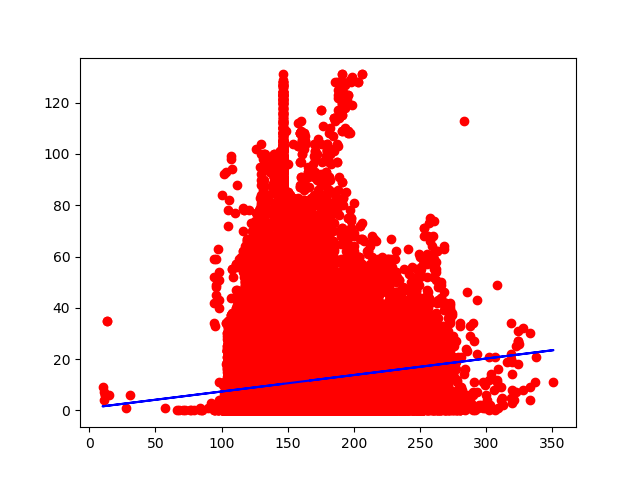

Title: Linear Regression on Boxing Data
Category: machine_learning
Date: 2018-08-28
Modified: 2018-08-28
Tags: python, machine learning, ai, linear regression
Slug: simple-linear-regression
Authors: Dylan Campbell
Summary: Using simple linear regression on a boxing bouts dataset.

# Preface
I recently made the decision that I want become more comfortable with machine learning. I've done a couple projects on it, but I wouldn't say I'm a machine learning guy. 

So for today's blog, I wanted to start simple with [Simple Linear Regression](https://en.wikipedia.org/wiki/Simple_linear_regression), which is a an algorithm which tries to draw a best fit line that minimizes the SSE (Sum of Squared Errors), which is basically saying minimize the overall error from the residual values(values that do not perfectly sit on the best fit line). For a better grasp, I'd highly recommend [this video](https://www.youtube.com/watch?v=ZkjP5RJLQF4), he did an excellent job simplifying the concept. I came across a [boxing dataset](https://www.kaggle.com/slonsky/boxing-bouts) on Kaggle and immediately knew thats what I wanted to use. Not for logical reasons, purely biased ones. Lets see how much weight relates to KOs achieved. (There are obvious issues with making this correlation, but lets have some fun.) 

# Tools used:
* [python3](https://www.python.org/download/releases/3.0/)
* [numpy](http://www.numpy.org/)
* [pandas](https://pandas.pydata.org/)
* [matplotlib.pyplot](https://matplotlib.org/api/pyplot_summary.html)
* [sklearn](http://scikit-learn.org/stable/)

## Let's Begin
First I wanted to import the dataset. Luckily [pandas](https://pandas.pydata.org/) handles that fairly simple. I used [iloc](https://pandas.pydata.org/pandas-docs/version/0.17.0/generated/pandas.DataFrame.iloc.html) to select the columns to set the inputs and outputs. Since I was planning on testing simple linear regression, I wanted to select 2 columns to work with. I chose the boxers' weights as the inputs to predict how many KOs(outputs) the boxers have. My hypothesis was that it'd probably not fit perfectly on a regession line, but we still test for science!

```python
# import the dataset
dataset = pd.read_csv('bouts_out_new.csv')
X = dataset.iloc[ : , 8].values # (inputs) weight column
Y = dataset.iloc[ : , 16].values # (outputs) KOs column
```

Next its time to do some preprocessing. I noticed there was a lot of missing data. Found that [sklearn](http://scikit-learn.org/stable/) handles that fairly simply. Using the [Imputer](http://scikit-learn.org/stable/modules/generated/sklearn.preprocessing.Imputer.html)(which literally means to fill in missing data) function, I was able to fill in the empty slots with the mean value of the data in the given column.

```python
# handle missing data
from sklearn.preprocessing import Imputer
imputer = Imputer() # Use imputer to replace all the missing values with the mean of the columns
X = imputer.fit_transform(X.reshape(-1,1)) # Had to reshape my 1D arrays to 2D arrays before filling the values
Y = imputer.fit_transform(Y.reshape(-1,1)) # This is since I only used a single column for each of these values and imputer expects 2D arrays
``` 
There is more preprocessing I could do, but I wanted to go ahead and get some feedback.

It was time to split my data into training and testing. Once again, [sklearn](http://scikit-learn.org/stable/) had a handy function called [train_test_split](http://scikit-learn.org/stable/modules/generated/sklearn.model_selection.train_test_split.html#sklearn.model_selection.train_test_split).

```python
# split into training and testing
from sklearn.model_selection import train_test_split
X_train, X_test, Y_train, Y_test = train_test_split(X.reshape(-1,1), Y.reshape(-1,1), test_size = 0.2) # dedicate 20% to test data
``` 

With the testing and training ready, it was time to set up the simple linear regression model. [Sklearn](http://scikit-learn.org/stable/) had a model handy, [LinearRegression](http://scikit-learn.org/stable/modules/generated/sklearn.linear_model.LinearRegression.html). Just imported it and fitted it my training data.

```python
# Fit the simple linear regression model to training set
from sklearn.linear_model import LinearRegression
regressor = LinearRegression()
regressor = regressor.fit(X_train, Y_train)
```

Excellent! Now all that is left to actually get some visual feedback on how great/horrible this model worked with out data. Using [matplotlib](https://matplotlib.org/api/pyplot_summary.html), I was able to display a scatterplot of our data points and the best fit line that was created. Now for the moment of truth.

```python
# Visualize train results
print('Visualize')
plt.scatter(X_train, Y_train, color = 'red')
plt.plot(X_train, regressor.predict(X_train), color = 'blue')
plt.show()
```


```python
# Visualize the test results
plt.scatter(X_test, Y_test, color = 'red')
plt.plot(X_test, regressor.predict(X_test), color = 'blue')
plt.show()
```


Okay.. well, it went about as well as I assumed. There does seem to be a sort of hill formation, which is not at all linear. This would most likely work better on a different model. I may come back to this dataset later on.

As for now, I'm just happy to get my hands dirty with some machine learning.